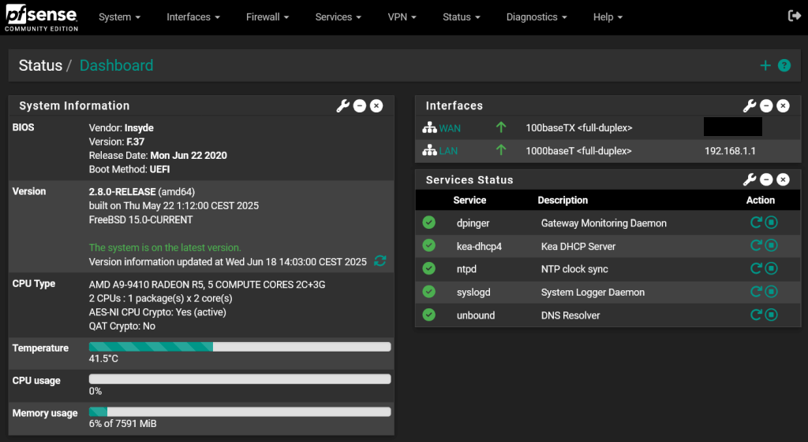
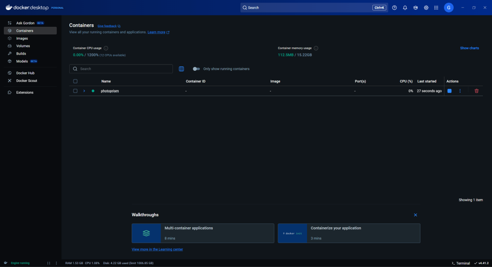

### *to be continued...*

# **Welcome, in my HomeLab Project!**

## Details:

<details>
<summary><strong>  Introduction – Who I am and what this project is about</strong></summary>

---

My name is Viktor Halupka, I was born in Budapest, and I have been living in Austria since 2014.  
Since my childhood (Commodore 64), I have been interested in the world of IT, but I worked in the gastronomy industry for a long time.  
At the age of forty, however, I decided to make a dream come true: to work professionally with IT, networks, and servers.

This homelab project is the first step on that path: I am building a real, working test environment on my own budget and in my free time, in order to gain hands-on experience in system and network administration.

This is not a perfectly sterile lab, but rather a fine worked, dynamically evolving learning platform, with its own mistakes, solutions, and documentation.

### My goal with this project is to:  
- demonstrate my progress,
- build a stable, remotely accessible, container-based home service platform that also serves as a learning environment,  
- help other beginners who are starting a similar journey, and  
- convince my future employer that they are dealing with a motivated, eager-to-learn, and practical-minded person.

**It’s never too late to change direction – the only thing that matters is that you take the first step.**

</details>

---

<details>
<summary><strong>  Equipment Overview |2025|</strong></summary>

---

#### Workstations and Servers

#### MSI Thin 15 B12UC laptop: 
- CPU: Intel Core i5 (12th generation)  
- RAM: 32 GB  
- VGA: Nvidia RTX 3050  
- Storage: 1 TB NVMe SSD  
- OS: Fedora Linux  
- Purpose: Learning system administration, network simulations, monitoring  

#### Windows 11 Pro PC (main server): 
- CPU: Intel Core i7-8700K  
- RAM: 32 GB  
- VGA: Nvidia RTX 3060 Ti  
- Storage: 2× 1 TB NVMe SSD, 1 TB HDD  
- Roles: Plex + Tailscale media server, planned NGINX web server  

#### HP 15-ba106ng laptop (pfSense router): 
- CPU: AMD A9-9410  
- RAM: 8 GB  
- Storage: 1 TB HDD  
- OS: pfSense (fresh install, in configuration)  
- Roles: Firewall, DHCP, NAT, VLAN, port forwarding, VPN (WireGuard planned)  

### Network

---

- Netgear GS308E managed switch (8 ports)  
- UNI USB–Ethernet adapter for HP laptop  
- ISP Routers:  
  - ZTE MC888A Ultra (5G, main internet)  
  - ZTE H338A (4G, backup)  

### Mobile Devices

---

- iPhone 11 (static public IP, uses Tailscale)  
- Samsung tablet (Android 14, media playback, remote access)  

### Backup and Security

---

- Using pfSense Firewall
- Weekly full system backup
- Planning incremental backups  
- Documents on OneDrive for mobile access  
- Plexamp + Tailscale used during commutes for music  
- Tailscale exit node automatically enabled on iPhone for public network security  

</details>

---

<details>
<summary><strong>  Planned Developments</strong></summary>

---
  
- Set up NGINX web server on Windows  
- Create basic static website for portfolio/monitoring  
- Finish pfSense full configuration  
- Automate Wake-on-LAN and remote management  
- Update automation with Ansible
- Docker installation with Photoprism for photo cataloging and secure, remote access from mobile
- Planning Wake-on-LAN and remote server control automation 

</details>

---

# Lord of the Rules: The Two Interfaces |pfSense| 18|06|2025 🧙‍♂

<h2 style="color:#8B0000;"> The Sysadmin's Verse</h2>

<pre style="color:#FF4500; background-color:#1a1a1a; padding:1em; border-radius:10px; font-family:Consolas,Monaco,monospace;">
One Firewall to rule all them,
One DNS to find them,
One DHCP to bring them all,
And in the darkness bind them.
</pre>

*A pfSense tale where NAT and DHCP rules reign supreme - and only one sysadmin apprentice stands between order and chaos.*



> *"Tuned in the darkest corners of Mordor..."*

<sub><i>Status of my pfSense - minimal CPU load, low memory usage, and a KEA-powered DHCP. Yes, DNS Unbound still reigns supreme.</i></sub>

## Story
This isn’t just a HomeLab project. This is an epic.

An old HP laptop, once forgotten, rises again – not as a client, but as a firewall.  
The hero's journey spans two interfaces: one toward the ISP, one into the heart of the LAN.  
Along the way, they face mythical entities such as `dhcpd`, the `pfctl` daemon, and the fearsome `Unbound`.

## The Quest ⚔️
- [x] Install pfSense (The Wall) on a 2017s laptop that wheezes under load.
- [x] Configure WAN/LAN interfaces (with some reboot rituals).
- [x] Grant LAN devices access to the internet – *finally*.
- [x] Explore the dark arts of port forwarding.
- [ ] Never reinstall again (lol, sure...).

---

<details>
<summary><strong> Network Topology - 2025 Summer Edition</strong></summary>

---

### 1. ISP Router
- Acts as the upstream connection to the internet.
- Either in bridge mode or with DMZ pointing to pfSense.
- Connected via Ethernet to the pfSense WAN interface.

### 2. pfSense
- Serves as the main router and firewall.
- Interfaces:
  - **WAN** → connected to ISP router.
  - **LAN** → connected to local network via a switch.
- Provides:
  - DHCP and DNS for the LAN.
  - NAT, port forwarding, and firewall rules.
  - Future plans: pfBlockerNG, Tailscale subnet routing.

### 3. LAN Switch
- Connected to the pfSense LAN port.
- Distributes LAN connectivity to wired devices and access points.

### 4. Devices connected to the switch
- **PC (Windows 11 Pro)**
  - Hosts Plex Media Server and PhotoPrism (via Docker/Portainer).
  - Also used for general administration and monitoring.
- **ZTE Router (WLAN Access Point Mode)**
  - Provides Wi-Fi only (DHCP disabled).
  - Connected via Ethernet to the switch.
    

### 5. Devices connected via Wi-Fi (through ZTE AP)
- Smartphones
- Tablets
- Smartwatch
- Nokia streaming box
- HP printer
- IoT gadgets

</details>

---

### Traffic Flow Summary 🔁

[Internet] → [ISP Router] → [pfSense WAN] → [pfSense LAN] → [Switch] → [PC / AP] → [Wi-Fi tools]

<sub><i>*...but seriously now:*</i></sub>

## Component Details

### 1. ISP Router
- **NAT**: Enabled – it's fine, as it only NATs traffic to pfSense.
- **DMZ**: Points to pfSense WAN IP – all ports are forwarded automatically.
- **DHCP**: Only active on its own LAN; pfSense gets WAN IP from here.
- **WiFi**: **Disabled** for security (no fallback access).
- **Access**: No direct access from LAN devices.

### 2. pfSense (the Wall is running on a 2017 HP laptop)
- **WAN**: USB Ethernet adapter connected to ISP router LAN.
- **LAN**: Built-in Ethernet connected to internal switch.
- **DHCP Server**: Active on LAN (`192.168.1.0/24` subnet).
- **DNS Resolver/Forwarder**: Enabled (details configurable).
- **Firewall**:
    - Primary, all traffic routed through it.
    - PfBlockerNG, GeoIP, DNSBL, Traffic Shaping configuration (but low CPU performance - confirm further actions).
    - Tailscale integration in progress.


### 3. LAN Switch
- Simple unmanaged gigabit switch distributing wired LAN.

### 4. Recycled ZTE Router (WLAN AP)
- **Mode**: Access Point only (no NAT or routing).
- **DHCP**: Disabled.
- **Purpose**: Provides WiFi to wireless clients.
- **Connection**: Wired to Netgear switch, part of pfSense LAN.

### 5. Win11 Pro PC (Main Server)
- **Roles**: Plex server, Docker containers (e.g. PhotoPrism), Portainer, PRTG.
- **Tailscale**: Connected to both LAN and mesh.
- **Interfaces**:
  - Physical: `Ethernet`, `Ethernet 2`.
  - Virtual: `Docker`, `Hyper-V`, `Tailscale`, `VirtualBox`.
- ⚠️Only `Ethernet` is the real LAN connection – others may interfere with routing or ARP.

### 6. PRTG Network Monitor
- Active monitoring of LAN and services.
- Helped diagnose key issues (e.g., ARP problems, disconnections).
- Currently replaces Zabbix.

## pfSense Disaster Recovery Guide

In a critical failure scenario (e.g. failed update, hardware corruption, misconfiguration), it is important to be able to **fully recover your pfSense system** quickly — ideally within minutes.

---

### Components of a Full Backup Strategy

| Component       | Method                                  | Frequency        |
|----------------|------------------------------------------|------------------|
| System Image    | Clonezilla disk image                   | Weekly or Monthly |
| Configuration   | pfSense XML backup (via Web UI)         | After every change |
| Diagnostics     | PRTG monitoring system                  | Ongoing           |

> *Clonezilla creates a full, bootable disk image, allowing you to restore pfSense with all packages (e.g. pfBlockerNG, DNSBL, GeoIP, Tailscale, etc.) and settings intact.*

### XML Configuration Backup via pfSense
While this does not include the OS or packages, it is still an essential component for rapid rebuilds.

Steps:

- Go to Diagnostics - Backup & Restore
- Select Download Configuration as XML
- Optionally encrypt the file
- Save it to your Cloud or secure external drive

Restore:

- Use the Web UI or console to upload your saved configuration


## Security Overview

- **Dual Firewall**: ISP Router + pfSense, but traffic is transparently forwarded to pfSense via DMZ.
- **ISP WiFi**: Fully disabled for added security.
- **Only one WiFi AP**: via ZTE router in AP mode.
- **No direct port exposure** from internet to LAN.
- **Plex**: Accessible only via LAN and/or Tailscale mesh.
- **Tailscale**: Running on main server and connected containers.
- **Static IPs**: Clean setup, no conflicts.

---

## Summary

This HomeLab setup focuses on a layered security approach, full control of LAN traffic through pfSense, and enhanced visibility with PRTG. Tailscale creates a secure mesh overlay, and Docker hosts key self-hosted apps like PhotoPrism or Plex.


---

<details>
<summary><strong>  Docker - The beginning 11|06|2025</strong></summary>

---

As part of the HomeLab, I used Docker containerization to host isolated, manageable home services. During the project, I resolved several technical issues and successfully deployed several services.



## Problem:

- Installed Docker and WSL2 on Windows 11, but the WSL2 initially failed to start due to misconfigured .wslconfig.

## Fixing WSL `automount` Configuration: 🔨

> **Note:** `crossDistro = true` is **not** a valid key in the `[automount]` section, so WSL throws an unknown key error if you include it.

####  Correct `[automount]` Configuration Example:

```ini
[automount]
root = /mnt/host
options = "metadata"
```
---

### Restarting WSL and Docker Container

After saving the correct `.wslconfig` file, restart WSL and the Docker container:

```powershell
wsl --shutdown
```

```powershell
wsl
```

```powershell
docker compose up -d
```

> *WSL2 should now run reliably, and Docker should successfully start the container.*

## Problem:

- Docker Desktop Startup Issue on Windows
- When Docker Desktop is set to start automatically with Windows, the following issues occur:

1. **WSL Initialization Error**: On boot, Docker shows an error indicating that WSL is not loaded yet.
2. **Engine Startup Failure**: Shortly after, another message appears (e.g., *Fetching issue*), and the Docker engine does not become usable.
3. **Workaround Required**: Even if Docker Desktop is manually shut down, the issue persists unless further steps are taken.

## Solution: 🔨
### To get Docker Desktop working properly again:

1. Fully exit Docker Desktop (`Right-click → Quit Docker Desktop`).
2. Open `Event Viewer`, or alternatively use Task Manager or PowerShell.
3. Locate and terminate the `com.docker.build.exe` process.
4. Restart Docker Desktop manually.

## After performing these steps, Docker works normally.

### Suspected Cause
This may be due to **slow WSL initialization on system startup**, especially if Docker and/or WSL-related components are located on a **mechanical HDD**. The delayed loading could cause Docker to attempt to start before WSL is fully ready.

### Suggested Fix
Try moving Docker's WSL-related files and configuration (or the entire Docker installation) to a **solid-state drive (SSD)**. This might ensure faster startup and proper synchronization with WSL during boot.

> **Note:** WSL2 boot speed improved: confirmed SSD is significantly faster than HDD when hosting the virtual disk.

---

💡Feel free to open an issue or contribute a better workaround if you've faced the same problem!

---

## Common Docker Commands with Explanations  
It will come in handy someday🙂

| Command                           | Description                                                                                 |
| --------------------------------- | ------------------------------------------------------------------------------------------- |
| `docker compose up -d`            | Starts the containers defined in `docker-compose.yml` in detached (background) mode.        |
| `docker compose down`             | Stops and removes the containers, networks, and volumes created by `docker-compose up`.     |
| `docker compose restart`          | Restarts all containers defined in the compose file.                                        |
| `docker ps`                       | Lists all currently running containers.                                                     |
| `docker ps -a`                    | Lists all containers, including stopped ones.                                               |
| `docker logs photoprism`          | Displays the logs/output from the container named `photoprism`. Useful for troubleshooting. |
| `docker exec -it photoprism bash` | Opens an interactive shell (`bash`) inside the running `photoprism` container.              |
| `docker stop photoprism`          | Gracefully stops the `photoprism` container.                                                |
| `docker start photoprism`         | Starts a stopped `photoprism` container.                                                    |
| `docker rm photoprism`            | Removes the `photoprism` container. It must be stopped first.                               |
| `docker images`                   | Lists all downloaded Docker images.                                                         |
| `docker image prune`              | Cleans up unused Docker images to free disk space.                                          |
| `docker volume ls`                | Lists all Docker volumes.                                                                   |
| `docker volume prune`             | Removes unused Docker volumes.                                                              |

---

## Finally some tests and settings

- Tailscale integration: successfully tested secure remote access to Docker containers (e.g., PhotoPrism) from mobile and Fedora machines

- PhotoPrism AI photo library: set up and secured using Tailscale + port forwarding. A private, smart photo library with AI-assisted organization

- Plex and Plexamp integration: music library is now securely available on mobile, even while commuting


## Planned next steps:

- Install Portainer: a web-based Docker management interface for easier container control

- Use Docker Compose: to manage multi-container setups (e.g., webserver + database)

- Further harden container access using Tailscale or WireGuard

- Reverse proxy setup planned: using Caddy or Nginx to simplify HTTPS and routing

---

</details>

---

## Logs:

<details>
<summary><strong> |08|06|2025|</strong></summary> 

---
  
## System Tweaks:
- Pagefile set to initial 1024 MB, max 4892 MB on SSD (works well with 32 GB RAM)

## Network Setup: 
- UPnP enabled (helps Plex and Tailscale)  
- SIP-ALG still on, will disable after Wi-Fi Calling off  
- MAC/IP/Port Filtering disabled (unnecessary)  
- DMZ not used  
- Manual port forwarding for Plex (32400) working; UPnP might be disabled
- pfSense configuration ongoing (WAN/LAN, VLAN, WireGuard, port forwarding)  

## Plex + Tailscale: 
- Direct connection enabled, better and stable streaming  
- iPhone uses Tailscale *exit node* depending on network  
- Plex works flawlessly over Tailscale  

</details>

---
